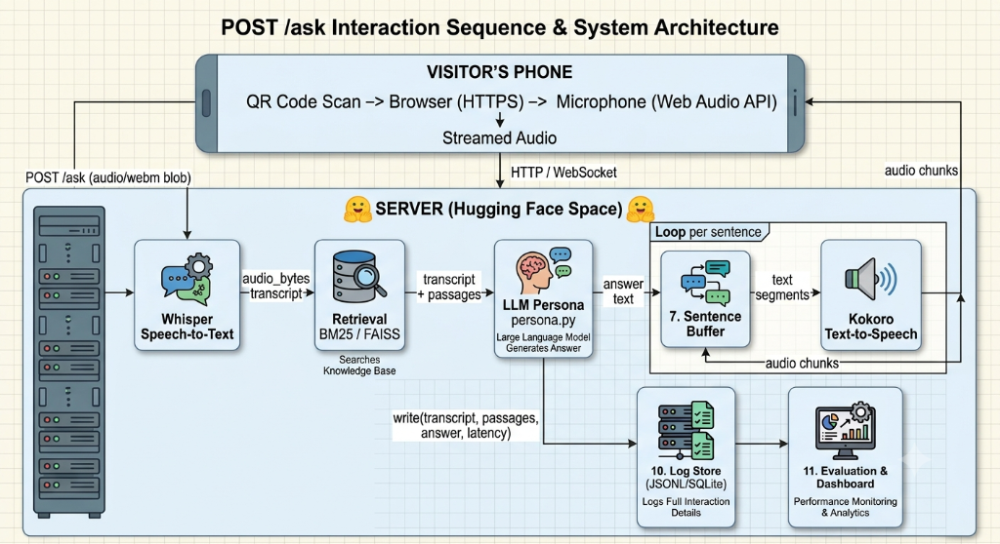
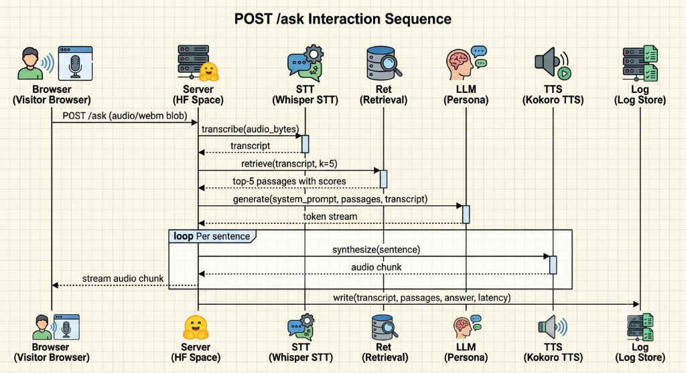
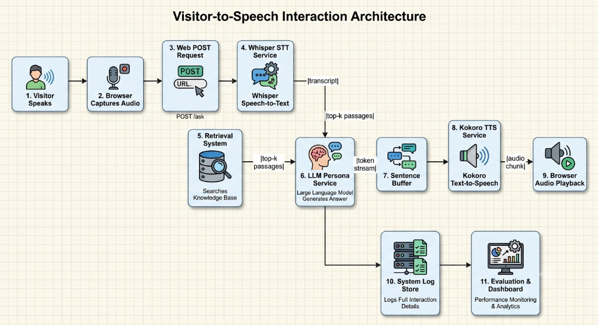
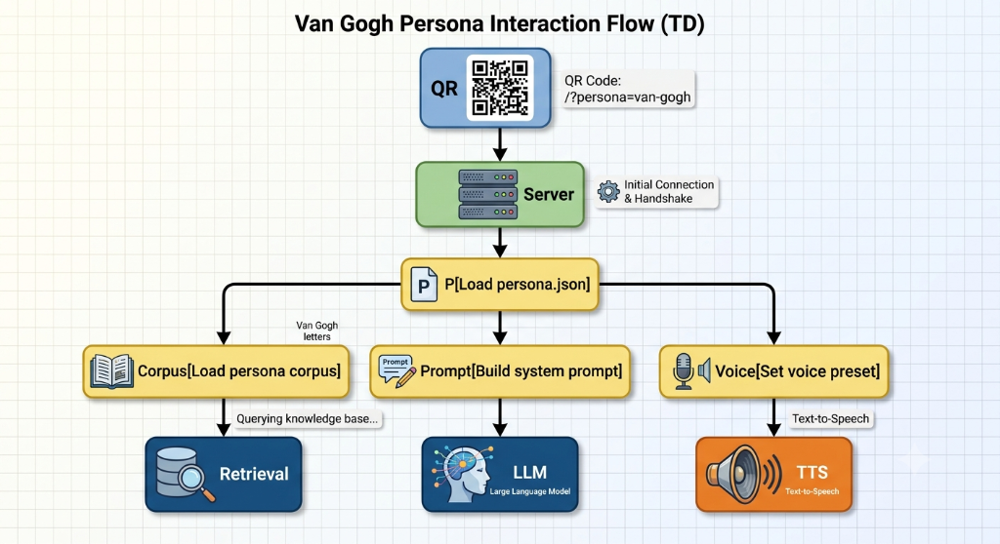
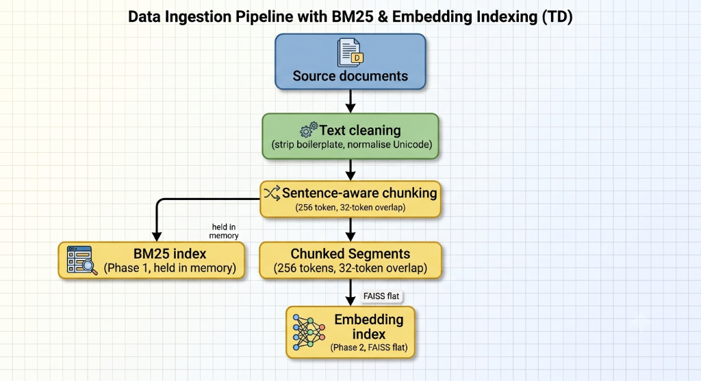

# System Architecture: Artifact Voice Platform

**Author:** Saurabh Gujar  
**Date:** September 22, 2026  
**Status:** Draft v1. Initial architecture specification. Voice pipeline implementation commences in Session 5.  
**Project:** NLP Final Project -- [nlp-final-project](https://github.com/SurabhiMore/nlp-final-project)

---

## Table of Contents

1. [Purpose](#1-purpose)
2. [Requirements](#2-requirements)
   - 2.1 [Functional Requirements](#21-functional-requirements)
   - 2.2 [Non-Functional Requirements](#22-non-functional-requirements)
   - 2.3 [Deployment Use Cases](#23-deployment-use-cases)
3. [System Architecture](#3-system-architecture)
   - 3.1 [High-Level Overview](#31-high-level-overview)
   - 3.2 [Request Sequence](#32-request-sequence)
   - 3.3 [Pipeline Flowchart](#33-pipeline-flowchart)
   - 3.4 [Persona Architecture](#34-persona-architecture)
4. [Component Design](#4-component-design)
   - 4.1 [Frontend](#41-frontend)
   - 4.2 [Speech-to-Text](#42-speech-to-text)
   - 4.3 [Retrieval](#43-retrieval)
   - 4.4 [Language Model and Persona Engine](#44-language-model-and-persona-engine)
   - 4.5 [Text-to-Speech and Voice Design](#45-text-to-speech-and-voice-design)
   - 4.6 [Server and Hosting](#46-server-and-hosting)
   - 4.7 [Logging and Evaluation Store](#47-logging-and-evaluation-store)
5. [Persona Configuration System](#5-persona-configuration-system)
   - 5.1 [Adding a New Persona](#51-adding-a-new-persona)
   - 5.2 [Persona Directory Layout](#52-persona-directory-layout)
   - 5.3 [persona.json Specification](#53-personajson-specification)
   - 5.4 [Content and Persona Safety](#54-content-and-persona-safety)
6. [Latency Budget](#6-latency-budget)
7. [Repository Structure](#7-repository-structure)
8. [Open Decisions](#8-open-decisions)
9. [Risk Analysis and Mitigations](#9-risk-analysis-and-mitigations)
10. [Milestones and Schedule](#10-milestones-and-schedule)
11. [Technology Reference](#11-technology-reference)

---

## 1. Purpose

This document specifies the technical architecture for the **Artifact Voice Platform**, an interactive voice-first retrieval-augmented generation system designed to give museum exhibits, historical artifacts, and educational subjects an interactive voice. 

Visitors or students approach an artifact, scan a QR code on their mobile device, ask any question aloud, and receive an immediate spoken response delivered in first person by the persona associated with that artifact. The response is strictly grounded in curated primary sources rather than open-ended model hallucinations.

The core platform architecture is subject-agnostic. The underlying voice, speech-to-text, retrieval, language model, and streaming infrastructure remain constant across exhibits. Deploying a new subject (for instance, Vincent van Gogh in an art gallery, a Tyrannosaurus Rex in a natural history wing, or Abraham Lincoln in a classroom) requires only uploading a curated corpus and creating a persona definition file. 

For this course project, the pilot implementation focuses on Vincent van Gogh. The pilot serves to validate pipeline latency, retrieval precision, and persona stability under realistic operating constraints before extending to additional subjects.

All latency figures in this initial draft are engineering estimates and design targets. Empirical measurements will be recorded and updated during Session 5 bench testing.

---

## 2. Requirements

### 2.1 Functional Requirements

| ID | Requirement | Description |
|---|---|---|
| FR-01 | Frictionless Web Access | The user accesses the voice interface via mobile web browser upon scanning a QR code, without installing native applications or creating accounts. |
| FR-02 | Voice Capture | The client application captures user speech using the browser Web Audio and MediaRecorder APIs over a secure HTTPS connection. |
| FR-03 | Speech Transcription | The server transcribes incoming audio recordings into clean text using an automated speech recognition pipeline. |
| FR-04 | Grounded Retrieval | The system queries a subject-specific curated knowledge base to identify relevant source passages matching the user question. |
| FR-05 | In-Character Generation | The system prompts a language model with retrieved evidence and persona instructions to synthesize a concise, first-person response. |
| FR-06 | Audio Synthesis and Streaming | The text response is converted to speech and streamed back to the client in progressive audio chunks to minimize time to first audio. |
| FR-07 | Interaction Logging | Every turn (transcription, retrieved passages, LLM output, and execution latencies) is recorded to a structured log file for evaluation. |
| FR-08 | Configurable Persona Engine | Exhibition curators can define persona voice, prompt instructions, boundaries, and knowledge bases purely through configuration files. |
| FR-09 | Graceful Fallback | When a visitor asks questions outside the documented knowledge base, the system delivers an in-character acknowledgment rather than fabricating facts. |
| FR-10 | Primary Language Support | The baseline implementation supports English queries and spoken responses. |

### 2.2 Non-Functional Requirements

| ID | Requirement | Target Metric | Rationale |
|---|---|---|---|
| NFR-01 | Turnaround Latency | Under 2.1 seconds | Visitor engagement drops significantly if silence exceeds two seconds in face-to-face exhibit settings. |
| NFR-02 | Speech-to-Text Latency | Under 800 ms | Transcription must finish rapidly to preserve budget for retrieval and language generation. |
| NFR-03 | Passage Retrieval Latency | Under 100 ms | In-memory indexing ensures retrieval adds negligible delay to the pipeline. |
| NFR-04 | Time-to-First-Token (TTFT) | Under 800 ms | Streaming models must start generating initial sentence tokens immediately. |
| NFR-05 | First-Chunk TTS Latency | Under 400 ms | The initial sentence must synthesize and transmit before subsequent text finishes generating. |
| NFR-06 | Audio Ephemerality | No audio persistence | Audio streams are processed strictly in memory and discarded immediately after transcription. |
| NFR-07 | Secure Transport | HTTPS / WSS strictly enforced | Mobile browsers refuse microphone hardware access unless served over TLS. |
| NFR-08 | Baseline Concurrency | 1 active stream on free tier | Pilot validation targets single-user demonstration stability on free cloud tiers. |
| NFR-09 | Architectural Extensibility | 0 code changes per exhibit | Adding an artifact requires only data files and JSON metadata. |
| NFR-10 | Factual Grounding | Evidence-bound generation | Output content must reflect documented corpus facts rather than unchecked pre-training memory. |

### 2.3 Deployment Use Cases

The platform serves multiple educational and cultural institutions through identical infrastructure:

| Domain | Example Persona | Target Audience | Primary Educational Value |
|---|---|---|---|
| Fine Art Museums | Vincent van Gogh, Claude Monet | General visitors, art students | First-person insight into color choices, emotional state, and documented correspondence. |
| Natural History Museums | Tyrannosaurus Rex, Woolly Mammoth | K-12 students, family groups | Engaging explanations of anatomy, prehistoric habitats, and fossil discoveries. |
| History Classrooms | Abraham Lincoln, Julius Caesar | Middle and high school classes | Interactive primary-source inquiry bringing curriculum figures to life. |
| Science Centers | Marie Curie, Albert Einstein | Students, public | Conversational walk-throughs of experimental discoveries and scientific principles. |
| Heritage Sites | Historic lighthouse keeper, monument architect | Cultural tourists | Localized narrative immersion rooted in regional oral history and municipal archives. |

---

## 3. System Architecture

### 3.1 High-Level Overview

The system operates across two physical tiers: the visitor client (mobile web browser) and the backend application server hosted on Hugging Face Spaces. The client manages hardware audio capture and streaming playback, while the server coordinates the speech-to-text, retrieval, persona synthesis, text-to-speech, and logging components.



### 3.2 Request Sequence

When a visitor speaks to an artifact, the request flows sequentially through the pipeline components, transitioning to a streaming loop as soon as the first answer sentence is formed.



Execution sequence matching the diagram:
1. **Client Audio Transmission:** The browser captures user speech and dispatches `POST /ask (audio/webm blob)` to the server.
2. **Audio Transcription:** The server calls `transcribe(audio_bytes)` on the Whisper STT service, returning a text `transcript`.
3. **Knowledge Retrieval:** The server invokes `retrieve(transcript, k=5)` against the retrieval index, returning the `top-5 passages with scores`.
4. **Prompt Assembly and Token Generation:** The server executes `generate(system_prompt, passages, transcript)` against the LLM Persona service, initiating a real-time `token stream`.
5. **Sentence-Level Audio Synthesis Loop (`loop Per sentence`):**
   - For each completed sentence buffered from the token stream, the server invokes `synthesize(sentence)` on the Kokoro TTS service.
   - The TTS service returns an `audio chunk`.
   - The server immediately dispatches `stream audio chunk` back to the browser for real-time playback.
6. **Interaction Logging:** Upon completion of response generation, the server calls `write(transcript, passages, answer, latency)` to the persistent log store.

### 3.3 Pipeline Flowchart

The operational block diagram illustrates the end-to-end processing pipeline across 11 discrete stages:



The numbered pipeline nodes correspond directly to the interaction stages:
1. **Visitor Speaks:** User articulates a question in front of the exhibit.
2. **Browser Captures Audio:** Client-side microphone recording via Web Audio and MediaRecorder.
3. **Web POST Request:** Audio payload dispatched to `POST /ask`.
4. **Whisper STT Service:** Audio transcribed into text (`transcript`).
5. **Retrieval System:** In-memory knowledge base queried, producing `top-k passages`.
6. **LLM Persona Service:** System prompt, passages, and transcript assembled to generate response text (`token stream`).
7. **Sentence Buffer:** Punctuation-delimited buffer accumulating tokens into sentences.
8. **Kokoro TTS Service:** Fast CPU speech synthesis yielding sequential `audio chunk` buffers.
9. **Browser Audio Playback:** Asynchronous client audio decoding and playback via Web Audio API.
10. **System Log Store:** Asynchronous recording of full interaction details (JSON Lines / SQLite).
11. **Evaluation & Dashboard:** Offline and nearline analytics for retrieval precision and latency tracking.

*(Note: In the high-level architecture diagram in Section 3.1, nodes 7, 10, and 11 explicitly reference these corresponding pipeline stages.)*

### 3.4 Persona Architecture

Each exhibit functions as an isolated configuration package. The server inspects the incoming visitor request query parameter (such as `/?persona=van-gogh`) and dynamically configures the retrieval index, system prompt, and text-to-speech profile without restarting the application service. The diagram below illustrates this loading flow using the Van Gogh pilot exhibit as the concrete example:



---

## 4. Component Design

### 4.1 Frontend

**Implementation Strategy:** Lightweight static web client utilizing Vanilla HTML5, CSS3, and modern JavaScript, served directly by the backend application server.

Mobile browsers mandate a secure context (HTTPS) to grant audio recording permissions. Audio capture utilizes the standard [MediaRecorder API](https://developer.mozilla.org/en-US/docs/Web/API/MediaRecorder) with standard fallback codecs (`audio/webm;codecs=opus` or `audio/mp4`). 

The audio output engine uses the browser [Web Audio API](https://developer.mozilla.org/en-US/docs/Web/API/Web_Audio_API) (`AudioContext`). Incoming audio chunks stream via chunked HTTP transfer encoding, are decoded into raw PCM buffers asynchronously, and schedule seamless sequential playback in an internal audio buffer queue. This architecture ensures playback begins as soon as chunk 1 arrives, masking subsequent LLM token generation and audio synthesis delays.

The visitor interface intentionally contains zero clutter:
- Tap-and-hold or click-to-talk interaction button.
- Subtle visual audio-level waveform feedback during active recording.
- Subtle state indicator during server processing and playback.

**Alternative Frontend Options Evaluated:**

| Technology | Trade-offs and Assessment |
|---|---|
| Single Page Framework (React, Next.js, Vue) | Rejected. Unnecessary bundle weight, complex hydration cycles, and build-step overhead for a single-screen exhibit page. |
| Native Mobile Apps (iOS Swift, Android Kotlin) | Rejected. High distribution friction. Museum visitors consistently resist downloading native apps for short interactions. |
| Progressive Web App (PWA) | Not required. Exhibit interactions depend entirely on server-side retrieval and model inference; offline caching provides no functional utility. |
| WebRTC Real-Time Media Gateway | Rejected for v1. Introduces substantial server complexity (STUN/TURN negotiation, signaling servers). Chunked HTTP streaming meets the latency target with simpler infrastructure. |

**References:**
- [MediaDevices: getUserMedia() API Documentation](https://developer.mozilla.org/en-US/docs/Web/API/MediaDevices/getUserMedia)
- [Web Audio API Core Concepts](https://developer.mozilla.org/en-US/docs/Web/API/Web_Audio_API/Basic_concepts_using_Web_Audio_API)

---

### 4.2 Speech-to-Text

**Selected Model:** [openai/whisper-large-v3-turbo](https://huggingface.co/openai/whisper-large-v3-turbo)  
**Licence:** MIT  
**Execution Target:** Under 800 ms on server CPU

Whisper large-v3-turbo is an optimized distillation of OpenAI Whisper large-v3 architecture. It delivers a 4x inference speedup over large-v3 while retaining near-identical word error rates (WER). Operating the model directly inside the application container prevents visitor voice audio from being transmitted to third-party APIs, reduces per-query cloud expenses to zero, and avoids external network hops.

Because museum visitors speak directly into their handset close to the microphone, acoustic conditions are favorable for automated transcription.

**Comparative Technology Analysis:**

| Model / Service | Expected WER (en) | Processing Speed (CPU) | Licensing / Cost | Privacy / Deployment | Reference |
|---|---|---|---|---|---|
| Whisper large-v3-turbo (Selected) | ~2.7% | ~0.6 s / 3s audio | MIT (Free) | Local Container Inference | [Hugging Face](https://huggingface.co/openai/whisper-large-v3-turbo) |
| Whisper large-v3 | ~2.5% | ~2.1 s / 3s audio | MIT (Free) | Exceeds acceptable CPU latency budget | [Hugging Face](https://huggingface.co/openai/whisper-large-v3) |
| Whisper base.en / small.en | ~6.0% | ~0.15 s / 3s audio | MIT (Free) | Fast, but struggles with accented or museum speech | [OpenAI GitHub](https://github.com/openai/whisper) |
| Deepgram Nova-2 | ~2.8% | ~0.25 s | Proprietary ($0.0043 / min) | Cloud API; requires audio egress | [Deepgram](https://deepgram.com/product/speech-to-text) |
| Google Cloud Speech-to-Text v2 | ~3.1% | ~0.20 s | Proprietary ($0.016 / min) | Cloud API; external data handling | [Google Cloud](https://cloud.google.com/speech-to-text) |
| Azure AI Speech | ~2.9% | ~0.22 s | Proprietary ($0.016 / min) | Cloud API; external data handling | [Microsoft Azure](https://azure.microsoft.com/en-us/products/ai-services/speech-to-text) |
| Browser Web Speech API | Highly variable | Client native (~0.1 s) | Free (Vendor dependent) | Inconsistent across browsers; broken on iOS Safari | [MDN Web Docs](https://developer.mozilla.org/en-US/docs/Web/API/Web_Speech_API) |

**References:**
- [Whisper: Robust Speech Recognition via Large-Scale Weak Supervision (Radford et al., 2022)](https://arxiv.org/abs/2212.04356)
- [Distil-Whisper: Robust Knowledge Distillation of Whisper Models (Gandhi et al., 2023)](https://arxiv.org/abs/2311.00430)

---

### 4.3 Retrieval

**Phase 1 (Active Implementation):** BM25 keyword matching via `rank-bm25`  
**Phase 2 (Planned Enhancement):** Dense semantic search using sentence-transformers and FAISS flat inner-product indexing  
**Target Retrieval Latency:** Under 100 ms

BM25 provides a reliable, transparent retrieval baseline. It operates entirely in memory, requires zero GPU allocation, introduces no embedding computation latency during query execution, and provides exact lexical scoring. When a museum visitor inquires about specific titles, dates, or proper nouns (e.g., "The Potato Eaters", "Arles", "Theo"), BM25 retrieves the exact documented passage reliably.

Dense retrieval will be added in Phase 2 to address thematic, emotional, and paraphrased queries (e.g., "how did you feel while painting in the asylum?"). Implementing BM25 in Phase 1 establishes an empirical benchmark against which Phase 2 semantic retrieval gains will be evaluated.



**Corpus Preparation Pipeline:**
1. Raw historical transcripts, primary source letters, and scholarly texts are stored in `personas/<id>/sources/`.
2. Ingestion pre-processing strips editorial headers, unifies Unicode representations, and standardizes punctuation.
3. Text is segmented using sentence-aware chunking targeting 256 tokens per block with a 32-token overlap between contiguous segments to maintain conversational context across chunk edges.
4. The tokenized output is saved to `personas/<id>/chunks.jsonl` and indexed in memory upon server initialization.

**Retrieval Options Evaluated:**

| Retrieval Method | Category | Advantages | Limitations | Reference |
|---|---|---|---|---|
| BM25 / Okapi (Phase 1) | Sparse lexical | Negligible CPU memory, deterministic, sub-10ms lookup | Struggles with synonymy and abstract queries | [rank-bm25](https://github.com/dorianbrown/rank_bm25) |
| Sentence-Transformers + FAISS (Phase 2) | Dense vector | Captures deep semantic intent and paraphrasing | Requires embedding computation step | [sbert.net](https://www.sbert.net/) / [FAISS](https://github.com/facebookresearch/faiss) |
| TF-IDF (Scikit-Learn) | Sparse lexical | Standard library support | Inferior term saturation and document length normalization compared to BM25 | [Scikit-Learn TF-IDF](https://scikit-learn.org/stable/modules/feature_extraction.html#tfidf-term-weighting) |
| Managed Vector Databases (Pinecone, Weaviate Cloud) | Managed cloud service | Scalable to millions of vectors | Overkill for under 10,000 exhibit passages; adds billing and cloud dependency | [Pinecone](https://www.pinecone.io/) |
| Local Document DBs (Chroma, LanceDB) | Embedded vector DB | Persistent file storage | Slower initialization than a simple in-memory FAISS flat index | [Chroma](https://www.trychroma.com/) |
| ColBERT / RAGatouille | Late interaction token retrieval | State-of-the-art passage reranking | High RAM consumption; excessive computational overhead for constrained CPU tiers | [ColBERT Paper](https://arxiv.org/abs/2004.12832) |

---

### 4.4 Language Model and Persona Engine

**Status:** Model candidate evaluation in progress; final selection confirmed in Session 5.  
**Inference Target:** Time to first token (TTFT) under 800 ms.

The `pipeline/persona.py` module encapsulates language generation. It accepts the active persona template, retrieved knowledge passages, and the transcribed question, streaming generated tokens back to the caller.

**Dynamic System Prompt Construction:**

```
You are {display_name}. A visitor is speaking with you at {exhibit_description}.
Respond in the first person, embodying the authentic persona, historical tone, and perspective of {display_name} as established in the documented sources below.

Strict Constraints:
1. Base your answer solely on the provided historical passages.
2. If the passages do not contain adequate evidence to address the inquiry, state honestly and in-character that you do not possess that knowledge.
3. Do not invent historical events, relationships, or artistic works not evidenced in the text.
4. Restrict your spoken response to {answer_max_sentences} sentences to remain concise and natural in conversation.

Documented Historical Passages:
{retrieved_passages}

Visitor Inquiry:
{transcript}
```

**Generation Parameters:**
- Context Window Control: Top 5 passages (~400 tokens) are injected, keeping total input context compact and accelerating prefill processing time.
- Temperature: Configured at 0.7 to balance expressive voice cadence with strict factual consistency.
- Stop tokens and max token caps prevent wandering monologues.

**Evaluated Language Models:**

| Model | Platform / Host | Context | Estimated TTFT | Cost per Query | Data Boundary |
|---|---|---|---|---|---|
| OpenAI GPT-4o mini | Cloud API | 128k | ~0.4 s | ~$0.0001 | Cloud API endpoint |
| Google Gemini 1.5 Flash | Cloud API | 1M | ~0.3 s | ~$0.00008 | Cloud API endpoint |
| Anthropic Claude 3.5 Haiku | Cloud API | 200k | ~0.5 s | ~$0.00025 | Cloud API endpoint |
| Meta Llama 3.1 8B Instruct | Local vLLM / Ollama | 128k | ~1.2 s (CPU) | Free | Fully self-hosted |
| Microsoft Phi-3.5 Mini | Local ONNX / PyTorch | 128k | ~0.8 s (CPU) | Free | Fully self-hosted |
| Mistral 7B Instruct v0.3 | Local / Hugging Face | 32k | ~1.0 s (CPU) | Free | Fully self-hosted |

**Phase 1 Strategy:** Utilize lightweight cloud inference (GPT-4o mini or Gemini 1.5 Flash) during prototyping to validate prompt stability and conversational pacing. Concurrently benchmark locally quantised Llama 3.1 8B (4-bit GGUF) on CPU to assess whether local execution can achieve acceptable response latency without commercial API subscriptions.

---

### 4.5 Text-to-Speech and Voice Design

**Baseline Model Engine:** [hexgrad/Kokoro-82M](https://huggingface.co/hexgrad/Kokoro-82M)  
**Licence:** Apache 2.0  
**Target Synthesis Latency:** First sentence audio synthesized in under 400 ms on CPU.

Kokoro-82M provides natural speech generation despite having only 82 million parameters. Its lightweight architecture executes on standard CPU hardware without requiring dedicated GPU acceleration. 

**Sentence-Level Streaming Architecture:**
Rather than awaiting completion of the entire LLM response, the application employs a sentence-level synthesis pipeline:
1. Incoming LLM tokens accumulate in a sentence buffer until terminating punctuation (`.`, `!`, `?`) is detected.
2. The extracted sentence is dispatched to the TTS synthesizer.
3. The resulting audio buffer is immediately transmitted to the visitor browser.
4. While the browser plays sentence 1, the LLM generates sentence 2, hiding synthesis latency behind ongoing playback.

**TTS Engine Evaluation:**

| Model / Service | Parameter Count | Perceived Naturalness | CPU Latency (sentence) | Licence / Cost | Reference |
|---|---|---|---|---|---|
| Kokoro-82M (Baseline) | 82M | High (MOS ~4.0) | ~0.3 s | Apache 2.0 (Free) | [Hugging Face](https://huggingface.co/hexgrad/Kokoro-82M) |
| MeloTTS | 45M | Moderate (MOS ~3.6) | ~0.15 s | MIT (Free) | [GitHub](https://github.com/myshell-ai/MeloTTS) |
| StyleTTS 2 | 148M | High (MOS ~4.4) | ~0.4 s | MIT (Free) | [GitHub](https://github.com/yl4579/StyleTTS2) |
| Coqui XTTS v2 | 456M | High (MOS ~4.2) | ~0.7 s | CPML (Non-commercial) | [GitHub](https://github.com/coqui-ai/TTS) |
| ElevenLabs API | Unknown | Exceptional (MOS ~4.7) | ~0.2 s | Commercial (~$0.003/1k chars) | [ElevenLabs](https://elevenlabs.io/) |
| OpenAI Audio TTS | Unknown | High (MOS ~4.3) | ~0.25 s | Commercial ($0.015/1k chars) | [OpenAI Docs](https://platform.openai.com/docs/guides/text-to-speech) |
| Microsoft Azure Neural TTS | Unknown | Very High (MOS ~4.4) | ~0.2 s | Commercial ($0.016/1k chars) | [Azure Speech](https://azure.microsoft.com/en-us/products/ai-services/text-to-speech) |

#### Voice Design Strategies

Persona voice creation follows one of two distinct strategies based on historical availability:

**Strategy 1: Historical Voice Recordings Exist**  
*Applicable to: 20th-century historical figures, modern authors, political leaders, archival recordings (e.g., Winston Churchill, Franklin D. Roosevelt, Maya Angelou).*

When authentic audio documentation exists:
1. Primary audio samples (1 to 5 minutes of clean speech) are gathered from public archives, library collections, or recorded broadcasts.
2. Background hiss, phonograph crackle, and room reverberation are cleaned using [Audacity](https://www.audacityteam.org/) or [Demucs](https://github.com/facebookresearch/demucs) neural audio separation.
3. Clean samples are submitted to a voice cloning model (such as ElevenLabs Instant/Professional Voice Cloning, OpenAI Custom Voice, or open-source Coqui XTTS) to generate a stable Voice ID.
4. At runtime, the generated text is synthesized using that dedicated Voice ID.

| Voice Cloning Solution | Audio Needed | Fidelity | Cost Structure |
|---|---|---|---|
| ElevenLabs Instant Cloning | 1 to 5 minutes | Very High | Usage-based cloud pricing |
| ElevenLabs Professional Cloning | 30+ minutes studio | Indistinguishable | Subscription tier |
| OpenAI Custom Voice | 1 to 2 minutes | High | Enterprise cloud API |
| Coqui XTTS v2 (Local) | 6 to 10 seconds | Good | Free (CPML non-commercial licence) |
| RVC (Retrieval-based Voice Conversion) | 5 to 10 minutes | Very Good | Free open-source tool |

**Strategy 2: Pre-Modern and Non-Recorded Subjects**  
*Applicable to: Ancient and renaissance figures, archaeological subjects, artistic creations (e.g., Vincent van Gogh, Leonardo da Vinci, Cleopatra, Tyrannosaurus Rex).*

When no recorded audio exists, voice design relies on structured acoustic profiles defined within `persona.json`:

| Exhibit Subject | Acoustic Voice Profile Specification | Target Tooling |
|---|---|---|
| Vincent van Gogh | Late 30s, Dutch-accented English, reflective, warm, deliberate tempo | Kokoro preset / ElevenLabs Voice Design |
| Leonardo da Vinci | Mid 50s, Italian-accented English, resonant, scholarly, intellectual cadence | Prompted Voice Synthesis |
| Cleopatra | Early 30s, Eastern Mediterranean cadence, regal, authoritative, measured pitch | ElevenLabs Voice Design |
| Ancient Philosopher | Late 50s, deep baritone, oratorical pacing, deliberate pauses | PlayHT / Kokoro preset |
| T-Rex (Youth Exhibit) | Low-register pitch shift with subtle guttural resonance mixed into backing track | Custom audio filter post-processing |
| Abraham Lincoln | Mid 50s, Kentucky/Indiana historical American register, solemn, deliberate | ElevenLabs Voice Design |

For the Van Gogh pilot, available Kokoro preset voices will be audited in Session 5 to select the voice best reflecting a 19th-century European artist. The selected preset identifier is stored directly in `personas/van-gogh/persona.json`.

---

### 4.6 Server and Hosting

**Target Platform:** [Hugging Face Spaces](https://huggingface.co/spaces) (Free Docker container runtime)  
**API Engine:** FastAPI (Python 3.10+)  
**Availability Profile:** On-demand during scheduled evaluation and testing windows.

Hugging Face Spaces provides native HTTPS termination at zero cost, fulfilling the security requirement for client microphone access. The base CPU tier allocates 2 vCPU cores and 16 GB system memory, sufficient to support in-memory BM25, Whisper large-v3-turbo, and Kokoro-82M.

FastAPI is chosen for its native asynchronous event loop and direct support for `StreamingResponse`, enabling audio chunks to stream to the browser over persistent HTTP connections without complex WebSocket handshake maintenance.

**Application Server Endpoints:**

| Endpoint | Method | Input Parameters | Output Response | Function |
|---|---|---|---|---|
| `/ask` | `POST` | `multipart/form-data`: `audio` (blob), `persona` (string) | `audio/wav` chunked stream | Main conversational pipeline entrypoint |
| `/health` | `GET` | None | JSON: status, memory load, active persona | Service health check and keep-warm ping |
| `/` | `GET` | Optional query: `?persona=<id>` | `text/html` | Serves client web application |

**Hosting Infrastructure Comparison:**

| Hosting Platform | Native HTTPS | Free Tier Specs | Inactivity Behavior | Suitability |
|---|---|---|---|---|
| Hugging Face Spaces (Selected) | Yes (Default) | 2 vCPU, 16 GB RAM | Sleeps after 48h idle | Optimal for academic ML demo |
| Render Free Web Service | Yes | 0.5 vCPU, 512 MB RAM | Sleeps after 15m idle | Memory insufficient for model inference |
| Railway App | Yes | $5 credit allowance | Continuous execution | Good alternative; requires budget tracking |
| Google Cloud Run | Yes | Pay-per-request | Container scales to zero | High cold-start penalty loading model weights |
| AWS Lambda | Yes | Pay-per-request | Severe container limitations | Incompatible with large in-memory model weights |

*Concurrency Notice:* The free Hugging Face container processes requests serially. Parallel visitor requests will queue. For larger exhibition deployments, upgrading to a dedicated GPU instance ($3.15/hr for Nvidia A10G) and implementing request batching will be required.

---

### 4.7 Logging and Evaluation Store

**Phase 1 Data Store:** Append-only JSON Lines file located at `logs/qa_log.jsonl`  
**Phase 2 Storage Target:** Embedded SQLite database for structured querying and dashboard visualization.

To preserve visitor privacy, raw audio recordings are never written to physical disk. Only the transcribed question text, retrieved passage identifiers, generated response, and component latency timestamps are retained.

**Structured Log Entry Schema:**

```json
{
  "timestamp": "2026-10-14T14:22:03Z",
  "session_id": "9b1deb4d-3b7d-4bad-9bdd-2b0d7b3dcb6d",
  "persona_id": "van-gogh",
  "question_transcript": "Why did you paint Starry Night?",
  "retrieved_passage_ids": ["vg_letter_595_chunk_02", "vg_letter_600_chunk_01"],
  "retrieval_relevance_scores": [0.892, 0.814],
  "llm_model_identifier": "gpt-4o-mini",
  "synthesized_response": "I painted the starry sky as an urgent need for religion, looking up into the vast night from Saint-Rémy.",
  "latency_metrics": {
    "stt_duration_ms": 580,
    "retrieval_duration_ms": 32,
    "llm_first_token_ms": 420,
    "tts_first_chunk_ms": 280,
    "total_turnaround_ms": 1312
  }
}
```

**Evaluation Harness:**
- `eval/questions.json`: Contains 20 curated test queries categorized into factual exhibit questions, interpretive questions, and out-of-scope queries.
- `eval/score.py`: Batch evaluation script processing log records to compute Precision@k for retrieved passages, automated ROUGE-L similarity scores against curated reference responses, and p50/p90 latency metrics across pipeline stages.

---

## 5. Persona Configuration System

### 5.1 Adding a New Persona

Creating a new exhibit requires no software modifications:
1. Create a directory named `personas/<persona-id>/`.
2. Author `persona.json` specifying exhibit metadata, system prompt template, voice preset, and boundary rules.
3. Place source text files into `personas/<persona-id>/sources/`.
4. Run the preparation script: `python scripts/build_corpus.py --persona <persona-id>`, which outputs clean `chunks.jsonl`.
5. Generate the exhibit QR code directing visitors to `https://<deployment-url>/?persona=<persona-id>`.

### 5.2 Persona Directory Layout

```
personas/
|-- van-gogh/
|   |-- persona.json              # Exhibit configuration and voice metadata
|   |-- sources/                  # Curated primary documents (letters, catalogue essays)
|   |   |-- letters_theovangogh.txt
|   |   +-- exhibition_catalogue.txt
|   +-- chunks.jsonl              # 256-token chunked text with metadata
|
|-- trex/
|   |-- persona.json
|   |-- sources/
|   |   +-- paleontology_faqs.txt
|   +-- chunks.jsonl
|
+-- lincoln/
    |-- persona.json
    |-- sources/
    |   +-- speeches_and_letters.txt
    +-- chunks.jsonl
```

### 5.3 persona.json Specification

```json
{
  "id": "van-gogh",
  "display_name": "Vincent van Gogh",
  "exhibit_description": "the Post-Impressionist masterwork gallery",
  "historical_era": "Late 19th Century (1853-1890)",
  "corpus_path": "personas/van-gogh/chunks.jsonl",
  "voice_strategy": "profile_preset",
  "voice_preset": "kokoro_warm_aged",
  "answer_max_sentences": 3,
  "temperature": 0.7,
  "system_prompt_template": "You are {display_name} in {historical_era}. A visitor approaches {exhibit_description}...",
  "out_of_scope_response": "I am an artist, dear visitor; matters beyond my life and work remain unfamiliar to me.",
  "safety_topics_blocked": ["self-harm", "violence", "contemporary_politics"]
}
```

### 5.4 Content and Persona Safety

To safeguard educational and family museum environments:
1. Keyword Pre-filtering: Transcribed input is compared against `safety_topics_blocked` before invoking the LLM.
2. In-Character Redirection: If flagged, the pipeline immediately returns `out_of_scope_response`, preventing adversarial prompt injection or sensitive topic elaboration.
3. Strict System Prompt Grounding: System prompts explicitly prohibit the LLM from drawing on external training weights when primary sources are silent on the subject.

---

## 6. Latency Budget

To maintain a fluid conversation, the time from the moment the user finishes speaking until audio playback begins must remain under 2.1 seconds.

```
Timeline (milliseconds, sequential stages showing overlap)

  0          500         1000        1500        2000 ms
  |           |           |           |           |
  [---- STT (0-800 ms) ---------------------------------------->]
              [-- Retrieval (< 100 ms) --]
                          [--- LLM TTFT (< 800 ms) ------------>]
                                          [-- TTS (< 400 ms) -->]
                                                       |
                                               AUDIO PLAYBACK BEGINS
```

| Pipeline Component | Allocated Target | Engineering Strategy |
|---|---|---|
| Speech-to-Text | 800 ms | Whisper large-v3-turbo executed on CPU |
| Evidence Retrieval | 100 ms | In-memory BM25 index lookup |
| LLM Time-to-First-Token | 800 ms | Compact prompt (under 800 total tokens) with streaming generation |
| TTS First Sentence Audio | 400 ms | Kokoro-82M synthesizing sentence 1 in isolation |
| **Total Cumulative Latency** | **2,100 ms** | Pipeline overlap: sentence 1 plays while remaining text synthesizes |

**Planned Optimizations:**
1. Sentence Chunking Pipeline: Transmitting audio as soon as sentence 1 completes synthesis saves 1.5 to 3 seconds compared to full-response synthesis.
2. Warm Process Initialization: All neural model weights (Whisper, Kokoro) load into RAM during server startup rather than per request.
3. In-Memory Index Caching: BM25 dictionaries are held continuously in memory to eliminate filesystem I/O per query.
4. Asynchronous Logging: Writing interaction details to disk occurs in background tasks after streaming starts.

---

## 7. Repository Structure

```
nlp-final-project/
|-- app/
|   |-- static/
|   |   |-- index.html            # Minimal mobile-first client interface
|   |   |-- style.css             # Fluid responsive layout
|   |   +-- main.js               # Audio recording and audio buffer streaming
|   +-- server.py                 # FastAPI application router and endpoints
|
|-- pipeline/
|   |-- __init__.py
|   |-- stt.py                    # Speech recognition: transcribe(audio_bytes) -> str
|   |-- retrieve.py               # BM25 and dense retrieval: retrieve(transcript, k=5) -> list
|   |-- persona.py                # Prompt construction and LLM: generate(system_prompt, passages, transcript) -> stream
|   +-- tts.py                    # Sentence buffer and TTS: synthesize(sentence) -> audio_chunk
|
|-- personas/
|   |-- van-gogh/                 # Pilot exhibit configuration
|   |   |-- persona.json
|   |   |-- sources/
|   |   +-- chunks.jsonl
|   +-- <additional-persona>/
|
|-- eval/
|   |-- questions.json            # 20 benchmark test queries and gold answers
|   +-- score.py                  # Evaluation execution and metric calculator
|
|-- logs/
|   +-- qa_log.jsonl              # Persistent query log
|
|-- evidence/
|   +-- README.md                 # User testing guidelines and experiment notes
|
|-- docs/
|   |-- architecture.md           # Master technical architecture document
|   |-- images/                   # System architectural and sequence diagrams
|   |-- data_sources.md           # Corpus selection and attribution
|   |-- lean_canvas.md            # Product strategy and user canvas
|   |-- roadmap.md                # Development roadmap
|   |-- user_research_plan.md     # Visitor study protocols
|   +-- team_process.md           # Contribution guidelines and workflow rules
|
|-- scripts/
|   +-- build_corpus.py           # Text cleaning and chunking pipeline
|
|-- .gitignore
|-- requirements.txt
+-- README.md
```

---

## 8. Open Decisions

The following architectural questions require empirical testing and team resolution in Session 5:

| Ref | Open Technical Question | Architectural Impact | Decision Plan |
|---|---|---|---|
| OD-01 | Cloud API versus Self-Hosted LLM | Latency, operational cost, and cloud dependency. Cloud APIs provide fast TTFT; local models eliminate external costs. | Benchmark GPT-4o mini alongside 4-bit Llama 3.1 8B on test hardware during Session 5. |
| OD-02 | Server Whisper versus Browser WebAssembly STT | Server CPU load and mobile network transfer. Client-side WASM STT requires heavy initial model download (~40MB). | Measure mobile network upload latency versus on-device WebAssembly initialization overhead. |
| OD-03 | Optimal Response Length | User dwell time and conversation pacing. Two sentences offer high brevity; four sentences provide richer historical detail. | Evaluate visitor attention and drop-off rates across 2-sentence and 4-sentence configurations during user trials. |
| OD-04 | Kokoro Preset Audition for Pilot Persona | Voice authenticity and engagement. | Perform a structured listening review of available Kokoro voices to identify the preset closest to 19th-century European cadence. |
| OD-05 | Container Keep-Warm Strategy | Hugging Face free instances sleep after 48 hours of inactivity, causing a 30-second cold start. | Implement a periodic cron health-check ping to keep the space active throughout demonstration days. |

---

## 9. Risk Analysis and Mitigations

| Risk Factor | Probability | Impact | Engineering Mitigation |
|---|---|---|---|
| Whisper CPU transcription latency exceeds 1.2 seconds | Moderate | High | Measure execution timing on target hardware in Session 5; if slow, fallback to Whisper small or cloud STT. |
| Cloud LLM rate limiting during live evaluation | Low | High | Maintain fallback API keys; pre-cache verified answers for the top 20 evaluation queries. |
| Robotic voice output degrading persona immersion | Moderate | Moderate | Audition all available Kokoro presets; keep ElevenLabs Voice Design integration as an alternative option. |
| Out-of-scope visitor inquiries causing hallucination | High | Moderate | Strict prompt constraints instruct the model to state ignorance in character rather than guessing. |
| Mobile browser microphone permissions blocked | Low | High | Enforce HTTPS across all deployment endpoints and provide concise visual permission guides in the web UI. |
| Cloud container cold-start delay during live demo | Moderate | High | Run automated keep-warm scripts against the `/health` endpoint before and during evaluation presentations. |

---

## 10. Milestones and Schedule

| Milestone | Objective | Key Deliverables |
|---|---|---|
| Session 4 (Current) | Architectural Baseline | Architecture specification approved and verified; repository structure initialized. |
| Session 5 | Local Voice Pipeline Validation | End-to-end Python pipeline (`stt.py` -> `retrieve.py` -> `persona.py` -> `tts.py`) running on laptop; preliminary latency verified. |
| Session 6 | Cloud Deployment on Hugging Face | Docker container running on Hugging Face Spaces; public HTTPS mobile web interface operational. |
| Session 7 | Pipeline Evaluation Pass | Execution of `score.py` over 20 standard evaluation questions; Precision@5 and latency metrics recorded. |
| Session 8 | Visitor Testing and Refinement | Execution of five structured user trials; recording qualitative feedback and usability notes in `evidence/`. |
| Final Milestone | Project Presentation | Live exhibition demonstration via mobile QR code; final project report submitted. |

---

## 11. Technology Reference

| Subsystem | Component | Version / Identifier | Licence | Reference Link |
|---|---|---|---|---|
| Speech-to-Text | Whisper Large v3 Turbo | `openai/whisper-large-v3-turbo` | MIT | [Hugging Face](https://huggingface.co/openai/whisper-large-v3-turbo) |
| Lexical Retrieval | rank-bm25 | `>= 0.2.2` | Apache 2.0 | [PyPI](https://pypi.org/project/rank-bm25/) |
| Vector Retrieval (Phase 2) | Sentence-Transformers | `>= 3.0.0` | Apache 2.0 | [sbert.net](https://www.sbert.net/) |
| Vector Index (Phase 2) | FAISS | `faiss-cpu >= 1.8.0` | MIT | [GitHub](https://github.com/facebookresearch/faiss) |
| Language Model (Cloud) | OpenAI GPT-4o mini | API Release | Commercial | [OpenAI](https://platform.openai.com/docs/models/gpt-4o-mini) |
| Language Model (Local) | Meta Llama 3.1 8B Instruct | `meta-llama/Llama-3.1-8B-Instruct` | Llama 3.1 Community | [Hugging Face](https://huggingface.co/meta-llama/Llama-3.1-8B-Instruct) |
| Text-to-Speech | Kokoro-82M | `hexgrad/Kokoro-82M` | Apache 2.0 | [Hugging Face](https://huggingface.co/hexgrad/Kokoro-82M) |
| Web Application Server | FastAPI | `>= 0.111.0` | MIT | [FastAPI](https://fastapi.tiangolo.com/) |
| ASGI Web Server | Uvicorn | `>= 0.30.0` | BSD-3-Clause | [Uvicorn](https://www.uvicorn.org/) |
| Cloud Hosting | Hugging Face Spaces | Docker SDK | Free Tier | [Hugging Face Docs](https://huggingface.co/docs/hub/spaces) |
| Audio Separation | Demucs | `>= 4.0.0` | MIT | [GitHub](https://github.com/facebookresearch/demucs) |
| Text Chunking | LangChain Text Splitters | `>= 0.2.0` | MIT | [LangChain](https://python.langchain.com/) |

---

*Document updated: September 22, 2026. Author: Saurabh Gujar. Status: Draft v1.*
